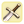
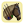
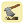
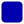

# tw-icons

## icons links (click on the icon to see more background colors)

### units
|   |   |   |   |   |   |   |   |
|:-:|:-:|:-:|:-:|:-:|:-:|:-:|:-:|
|  |  |  |  |  |  |  |  |
|  |  |  |  |  | | | |

### buildings
|   |   |   |   |   |   |   |   |   |
|:-:|:-:|:-:|:-:|:-:|:-:|:-:|:-:|:-:|
|  |  |  |  |  |  |  |  |  |
|  |  |  |  |  |  |  |  |  |

### misc
|   |   |   |   |   |   |   |
|:-:|:-:|:-:|:-:|:-:|:-:|:-:|
|  |  |  |  |  |  |  |

### customs
|   |
|:-:|
|  |

## empty backgrounds
| Red | Pink | Orange | Yellow | Purple | Green | Blue | Brown | White | Gray |
|:-:|:-:|:-:|:-:|:-:|:-:|:-:|:-:|:-:|:-:|
|  |  |  |  |  |  |  |  |  |  |
|  |  |  |  |  |  |  |  |  |  |
|  |  |  |  |  |  |  |  |  |  |
|  |  |  |  |  |  |  |  |  |  |
|  |  |  |  |  |  |  |  |  |  |
|  |  |  |  |  |  |  |  |  |  |
|  | | |  |  |  |  |  |  |  |
|  | | |  |  |  |  |  |  |  |
|  | | |  |  |  |  |  |  |  |
| | | |  |  |  |  |  |  |  |
| | | |  |  |  |  |  |  | |
| | | | |  |  |  |  |  | |
| | | | |  |  |  |  |  | |
| | | | |  |  |  |  |  | |
| | | | |  |  |  |  |  | |
| | | | |  |  |  |  |  | |
| | | | |  |  |  |  |  | |
| | | | |  |  |  | | | |
| | | | |  |  |  | | | |
| | | | | |  |  | | | |
| | | | | |  |  | | | |
| | | | | |  |  | | | |
| | | | | |  |  | | | |
| | | | | | |  | | | |
| | | | | | |  | | | |