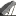
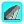
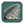
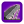

## archer 
| Red | Pink | Orange | Yellow | Purple | Green | Blue | Brown | White | Gray |
|:-:|:-:|:-:|:-:|:-:|:-:|:-:|:-:|:-:|:-:|
|  |  |  |  |  |  |  |  |  |  |
|  |  |  |  |  |  |  |  |  |  |
|  |  |  |  |  |  |  |  |  |  |
|  |  |  |  |  |  |  |  |  |  |
|  |  |  |  |  |  |  |  |  |  |
|  |  |  |  |  |  |  |  |  |  |
|  | | |  |  |  |  |  |  |  |
|  | | |  |  |  |  |  |  |  |
|  | | |  |  |  |  |  |  |  |
| | | |  |  |  |  |  |  |  |
| | | |  |  |  |  |  |  | |
| | | | |  |  |  |  |  | |
| | | | |  |  |  |  |  | |
| | | | |  |  |  |  |  | |
| | | | |  |  |  |  |  | |
| | | | |  |  |  |  |  | |
| | | | |  |  |  |  |  | |
| | | | |  |  |  | | | |
| | | | |  |  |  | | | |
| | | | | |  |  | | | |
| | | | | |  |  | | | |
| | | | | |  |  | | | |
| | | | | |  |  | | | |
| | | | | | |  | | | |
| | | | | | |  | | | |